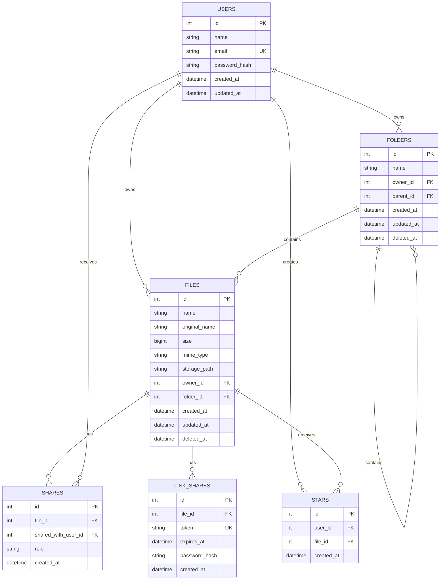

# Database ER Diagram

This diagram represents the database structure for the Cloud Based Media File Storage Service.

## Relationship Summary

- One user can own many folders.
- One user can own many files.
- One folder can contain many files.
- One folder can contain other folders.
- One file can be shared with many users.
- One user can receive many file shares.
- One file can have multiple public share links.
- One user can star many files.
- One file can be starred by multiple users.